# Lab5
working with docker

### 1. Проверка версии Docker

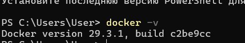

---

### 2. Авторизация в Docker Hub

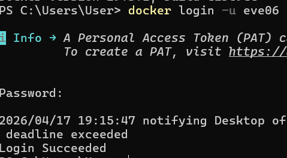

---

### 3. Поиск образов Debian

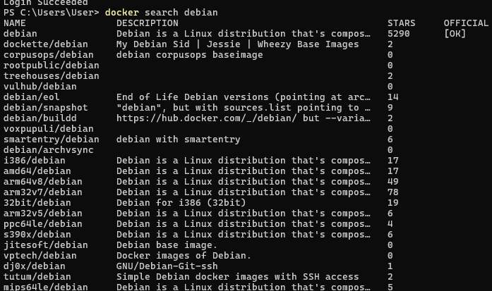

---

### 4. Просмотр локальных образов 

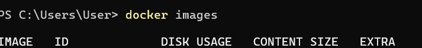

---

### 5. Список контейнеров 

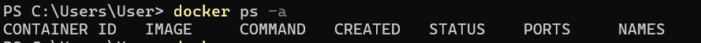

---

### 6. Список запущенных контейнеров (до запуска)

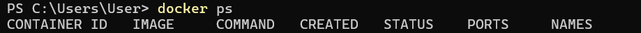

---

### 7. Скачивание образа Debian:trixie

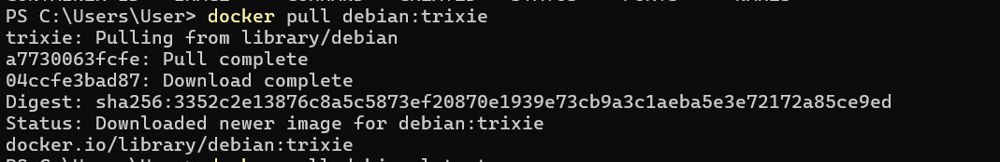

---

### 8. Скачивание образа Debian:latest

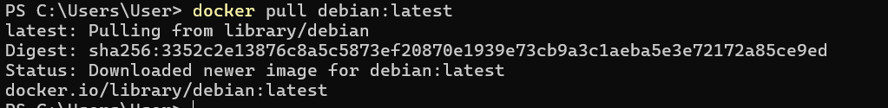

---

### 9. Список контейнеров 

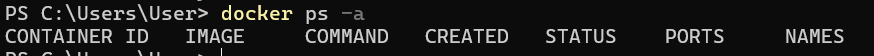

---

### 10. Список запущенных контейнеров

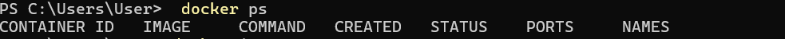

---

### 11. Просмотр списка образов 

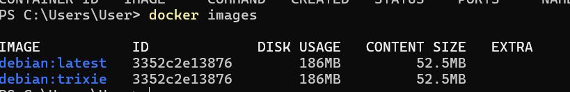

---

### 12. Запуск контейнера по имени образа

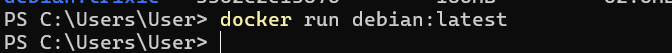

---

### 13. Запуск контейнера с именем cont-no1 по ID образа

---

### 14. Запуск контейнера cont-no2 в интерактивном режиме

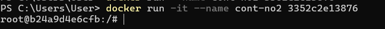

---

### 15. Список всех контейнеров

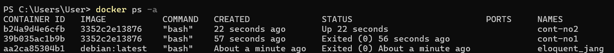

---

### 16. Список всех запущенных контейнеров

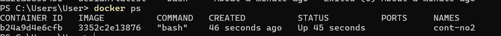

